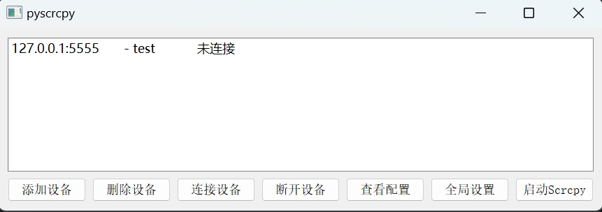

# pyscrcpy 设备管理工具

## 项目简介
基于PyQt5开发的Android设备管理工具，集成scrcpy屏幕镜像功能，提供便捷的设备管理和屏幕镜像操作。

## 功能列表
- ✅ 设备列表管理(添加/删除)
- ✅ ADB设备连接状态检测
- ✅ 一键启动scrcpy屏幕镜像
- ⚙️ 全局scrcpy参数配置
- 📁 配置信息持久化存储
- 📦 支持打包为独立可执行文件
- 🖱️ 右键菜单快捷操作
- 📋 设备ID快捷复制

## 环境要求
- Python 3.8+ 
- ADB工具 (需加入系统PATH)
- scrcpy 1.24+ (需加入系统PATH)

## 快速入门
```bash
# 安装依赖
pip install -r requirements.txt

# 运行程序
python main.py
```

## 配置管理
1. 设备配置文件：`pyscrcpy.json`
   - 自动保存设备列表和全局参数
   - 支持手动编辑（右键菜单"查看配置"）
2. 全局参数设置：
   - 通过界面设置scrcpy启动参数
   - 示例：`-m 1024 --turn-screen-off`

## 使用说明
1. 添加设备：
   - 格式要求：`IP:端口` (例：127.0.0.1:5555)
2. 连接设备：
   - 双击设备项或点击"连接设备"
3. 启动scrcpy：
   - 选择设备后点击"启动Scrcpy"

## 打包指南
```bash
# 安装pyinstaller
pip install pyinstaller

# 执行打包
python -m PyInstaller --name pyscrcpy  --onefile  --noconsole --icon=pyscrcpy.jpg --noupx --clean main.py
```

## 注意事项
- 首次使用请确保adb环境配置正确
- 设备连接需要开启USB调试模式
- 打包版本需在Windows环境下执行

## 界面预览
